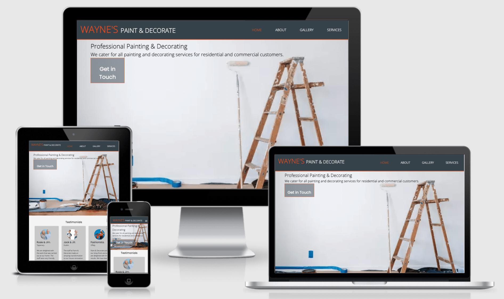
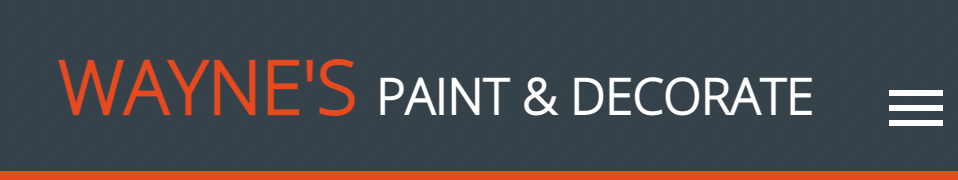
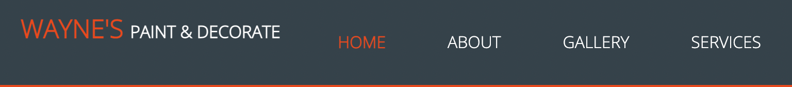

# Paint and Decorate Website

[View the live Project here](https://gregcotech007.github.io/paintanddecorate/index.html)

The above website was created for the purposes of a painting and decorating company. They would like to provide an online presence to their existing customer base and also to generate awareness and business exposure of their company brand.

It is designed for responsiveness across multiple devices, starting with mobile first, then expanding up to tablet, laptop and also desktop views, making it easy for potential customers and users to navigate the website.

## Table of Contents

## User Experience (UX)

### User Story

- First Time Visitors
As a First Time Visitor, I wanted to provide an easy to view website that provides information in relation to the services provided by the company, "Paint & Decorate".
As a First Time Visitor, I wanted to provide a "Get in Touch" button that links to the About Page, where the user has the option to complete the form. There is a drop-down menu to choose between "Get a Quote" or "General Enquiry".
As a First Time Visitor, I wanted to make the website responsive so that the user can move through the website, regardless if they are on mobile, tablet or desktop device.

- Realtine User Experience
The user had tried accessing the website from their mobile Android device.
They clicked on each on of the links and they responded to opening the correct lnks, while maintaing the correct image view for the mobile device.

- Realtime User Suggestions
There was no future feature suggestions at this time.

### Design

- Colour Scheme
- - I chose to use colours #f4f4f4, #35424a, #fff, rgba(0, 0, 0, 0.1), #e8491d, #ccc, #c8c8c8 & #3a3a3a across the website.

- Typography
- - The main font used on the website was Google Fonts: Open Sans & Poppins.

- Imagery
- - The showcase image was chosen to inform the user of a possible works for a client and showing some tools and equipment required to carry out and complete the works.

- Wireframes
- - Mobile Device Wireframes.
- - Desktop Device Wireframes.

### Features
- Responsive across multiple device platforms: mobile, tablet, laptop & desktop.
- - Mobile device (iPhone 5/SE):

- - Tablet device (iPad):

- Interactive elements.

### Technologies Used
#### - Languages

{:height="50%" width="50%"}

- Programs Used
- - [GitHub](https://github.com/):
- - - GitHub was used to backup instances of GitPod Workspaces at intervals.

- - [GitPod](https://gitpod.io/):
- - - GitPod was used as the main Language Editor for programming the website.

- - [Google Fonts](https://fonts.google.com/):
- - - Google Fonts was imported into the css file to allow use of the following fonts: ???

- - [Font Awesome](https://fontawesome.com/):
- - - Font Awesome was used to add Font Icons to improve the visual experience for the users.

- - [Balsamiq](https://balsamiq.com/):
- - - Balsamiq was used to create Wireframe design plans for both mobile and desktop views. 

# To Be Continued....(Work in Progress!)