# Paint and Decorate

[View the live Project here](https://gregcotech007.github.io/paintanddecorate/index.html)

The above website was created for the purposes of a painting and decorating company. They would like to provide an online presence to their existing customer base and also to generate awareness and business exposure of their company brand.

It is designed for responsiveness across multiple devices, starting with mobile first, then expanding up to tablet, laptop and also desktop views, making it easy for potential customers and users to navigate the website.

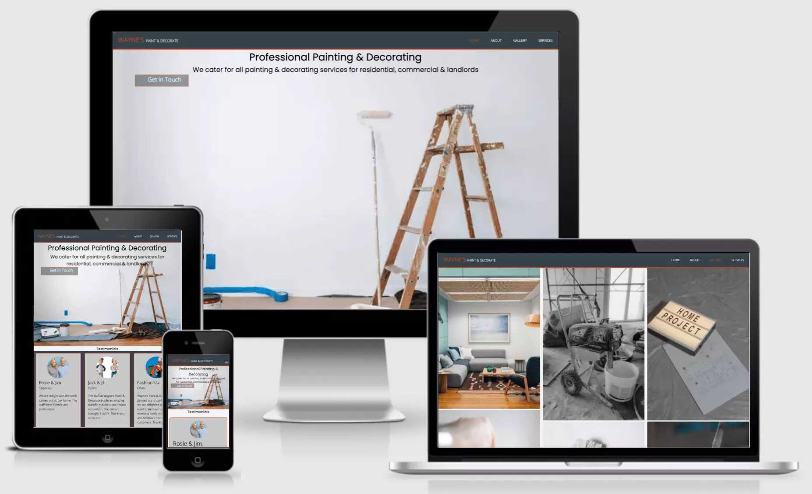

## Table of Contents

* [User Stories](#user-story)
* [Design](#design)
* [Features](#features)
* [Header](#header)
* [Showcase](#showcase)
* [Testimonials](#testimonials)
* [Footer](#footer)
* [Languages](#languages)
* [Programs](#programs)
* [Testing](#testing)
* [Deployment](#deployment)
* [Cloning](#cloning)
* [Credits](#credits)
* [Conclusion](#conclusion)

# User Experience (UX)

## User Story

### First Time Visitors

As a First Time Visitor, I wanted to provide an easy to view and navigate a website that provides information in relation to the services provided by the company, "Paint & Decorate".

As a First Time Visitor, I wanted to provide a 'Get in Touch' button that allows the user easy access to get in touch with the company. The link points to the About Page, where the user has the option to complete the form. There is a drop-down menu to choose between 'Get a Quote' or 'General Enquiry'.

As a First Time Visitor, I wanted to make the website responsive so that the user can move through the website easily, regardless if they are on mobile, tablet or desktop device.

### Realtime User Experience

The user accessed the website from their mobile Android device. They found it easy to navigate through the pages and the content was correctly linked and displayed to the screen.

The user clicked on each of the links that corresponded to the hamburger menu navigation, which consisted of 4 pages: Home, About, Gallery & Services.

The user found the colour scheme was easy on the eye and the quality of the images on the gallery were of a high quality.

### Realtime User Suggestions

There was no future feature suggestions at this time.

# Design

To better understand how the website was going to come together, it was better to compile ideas and either put them down on paper or use the digitial wireframe, or both.

Once the layouts were designed, it was easier to see how the site would be structured and how the layout would look on the different device screen sizes. Also, the content on the screen layout would also change. It is easier to visual plan the content view when you can see it laid out and therefore that saves time when the coding is ready to start.

- Wireframes: [Balsamiq](https://balsamiq.com/)

    - Mobile Device Wireframe.

    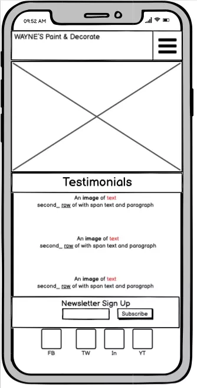
    
    - Tablet Device Wireframe.

    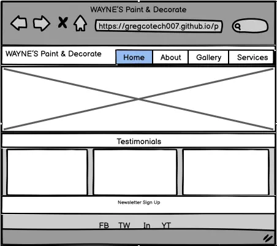

- Colour Scheme
    - I chose to use colours #f4f4f4, #35424a, #fff, rgba(0, 0, 0, 0.1), #e8491d, #ccc, #c8c8c8 & #3a3a3a across the website. The colours worked well together and provided a good visual experience to the user.

- Typography
    - The main font used on the website was Google Fonts: Open Sans & Poppins.

- Imagery
    - The imagery used on the website is loyalty-free.

#  Features

## Header

The header is consists of a company logo with the emphasis on the owners name as it is shown as larger and a brighter colour compared to the rest of the logo.

On the right-side of the header, there is a hamburger navigation menu which is diplayed for the mobile first view as shown in the following image:

Mobile device (iPhone 5/SE):

Once the screen size is increased to 768px or higher, then the hamburger menu disappears and it displays the navigation bar menu instead. See for following image:

Tablet device (iPad):

## Showcase

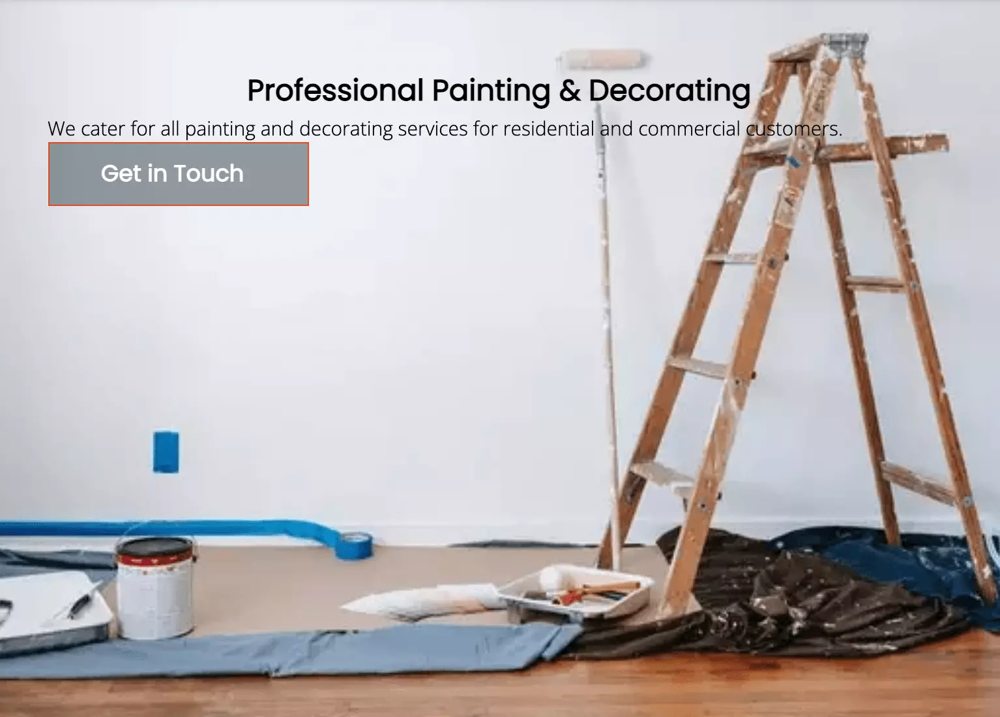

The showcase image was added below the header section. It provides a view of some if the tools and preparation that maybe required before a job takes place. Image shows a wooden ladder on the right with a long-handled paint roller beside it. There is a tin of paint, a paint roller tray, paint brush to the left of the image. Also there is covering placed on the floor and blue tape placed over the skirting board.

There is overlay text that provides a heading a paragraph text to the user.
Also, there is a 'Get in Touch' button which has a call to action and it links to the About Page that allows the user to complete the Contact form.

## Testimonials

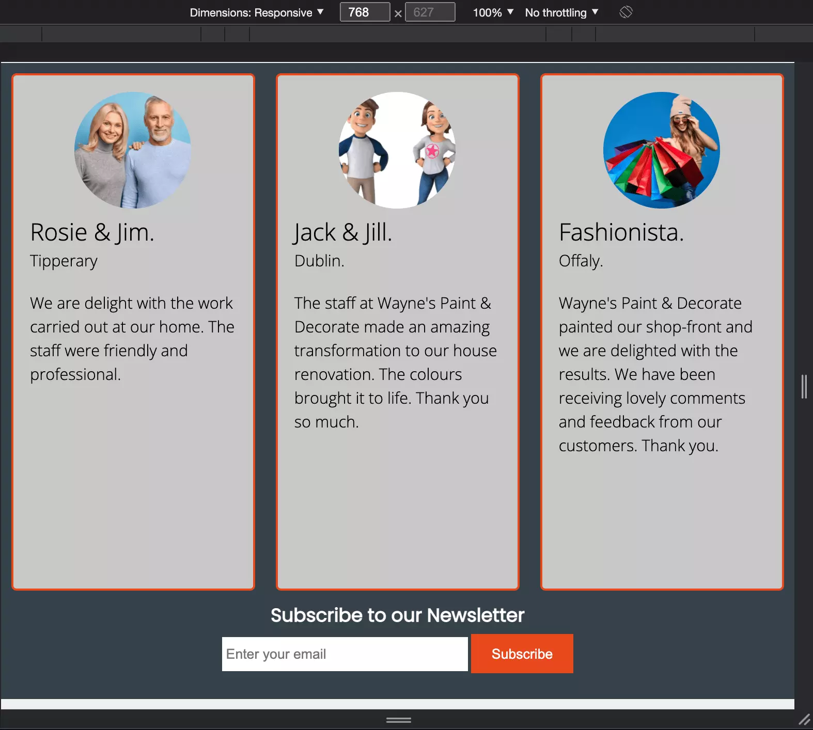

The testimonial section is shown when viewed on a device with screen of 768px or higher. There are three testimonials shown inline which includes the customer image, name, location county along with their review.

Once the screen size is reduced to mobile view, then the testimonial reviews are show in block as stacked singularly on top of each other.

## Newsletter Section

The newsletter section, shown in the image above, comprises of an input box that allows the user to enter email in order to subscribe to the newsletter. The 'Subcribe' button prevents the user from submitting the data unless there is a valid email address provided (required). The user will be prompted to add a valid email and if successful, the user will be provided with a newsletter signup thank you page.

## About Us

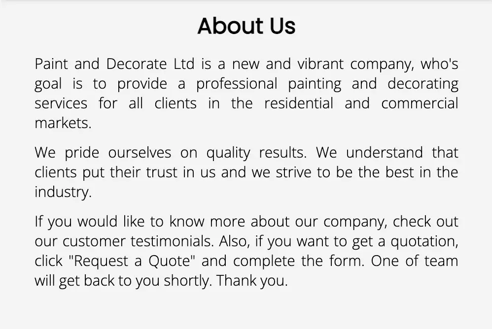

The About Us section provides information about the company, how long they are in business, services, and customer
'word of mouth'.

## Contact Form

The contact form provides an opportunity for the user to engage with the company through an electronic contact method.
The user has a drop-down form that allows them to choose between 'Get a Quote' or 'General Enquiry'.

The form is built with 'required' input options that prevents the user from submitting the form without completing all sections as required.

## Footer

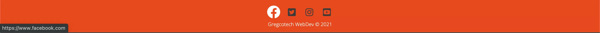

The Footer is comprised of Social Network links of four providers. Once the user hovers over the individual link, the icon increases in size and the icon font changes to white, in order to highlight it as a hover selection. When the user clicks on the individual link, a new blank window opens for the user to view the website link, while maintaining the user's existing position on the current page.

# Technology Used

## - Languages
- HTML5
 

- CSS3

## Programs

- [GitHub](https://github.com/):
    - GitHub was used to backup instances of GitPod Workspaces at intervals.

- [GitPod](https://gitpod.io/):
    - GitPod was used as the main Language Editor for programming the website.

# Testing

- After deployment, all features were check on a MacBook Pro, iMac, iPhone 12Pro Max. The browsers used to test the website was Safari and Google Chrome. I have included the following screenshot examples from the iPhone and MacBook Pro devices.

## iPhone 12 Pro Max
I tested all pages on the Safari browser and each page displayed correctly. A burger menu navigation was used on the smaller screen devices up to 780px, then the burger menu changes to the the full size navbar menu diplaying navigation links from left to right. The following examples are from the homepage.

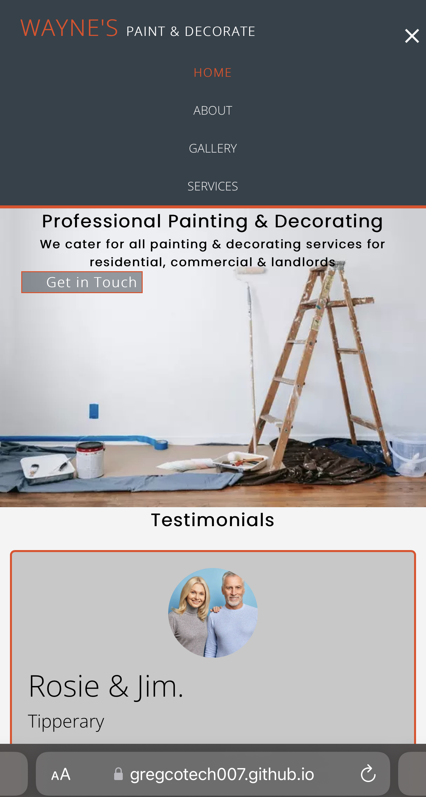
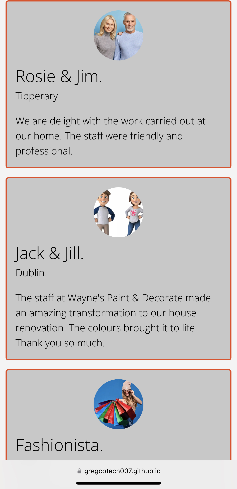
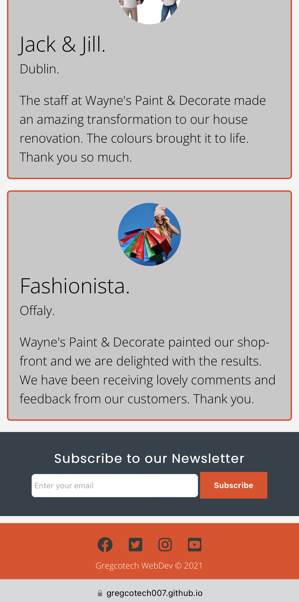

## MacBook Pro
I tested all pages on the Safari browser and each page displayed correctly. A navbar menu is shown with links to each link. The selected page is highlighted in the organge colour to indicate the page that they are currently viewing.

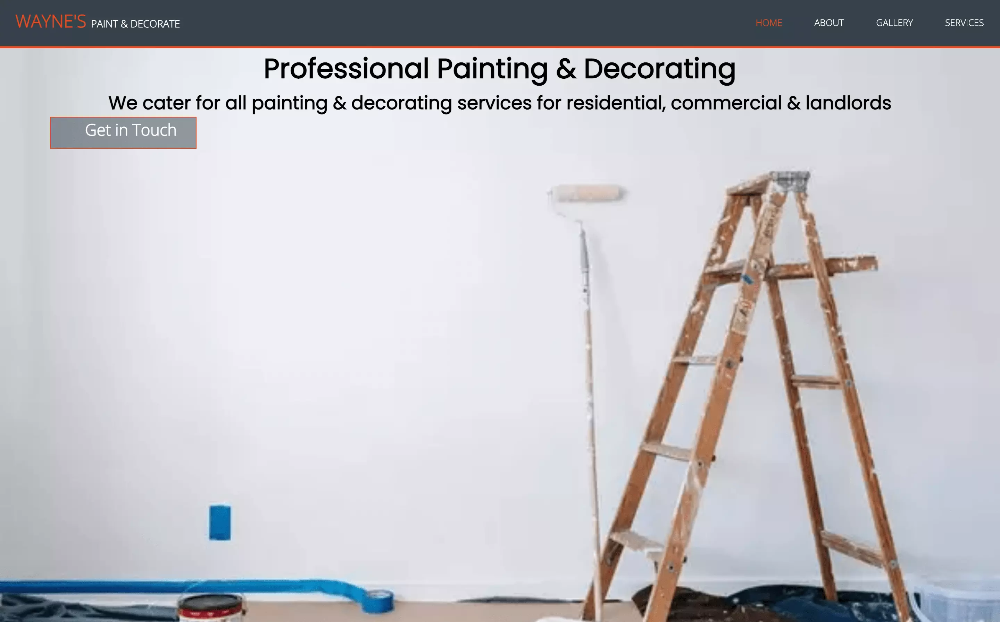
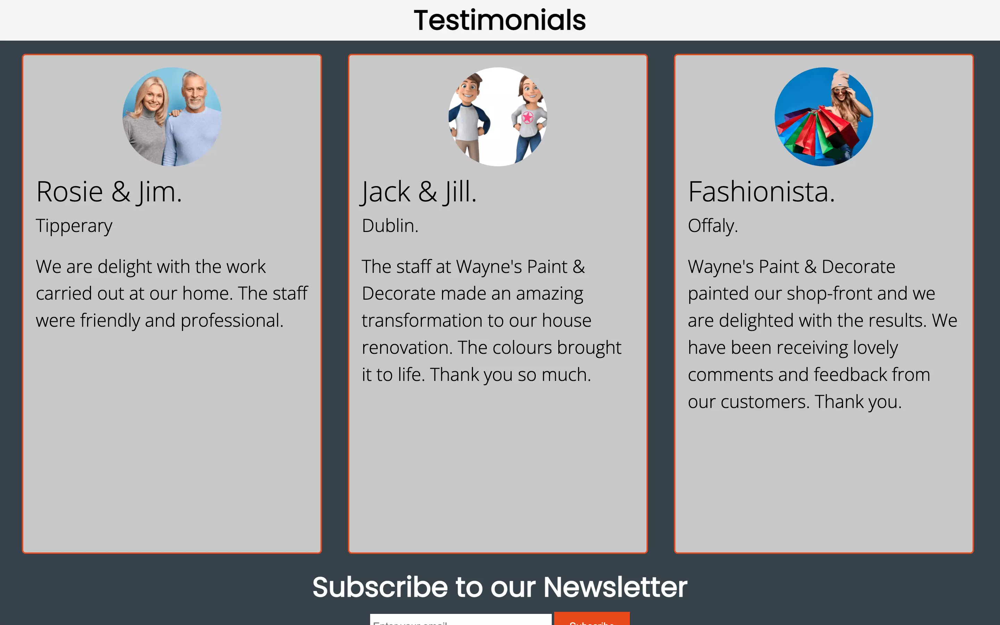
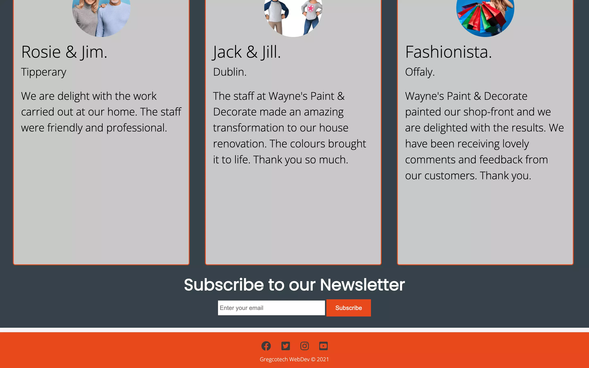

### Bug Testing
During the testing phase, I found that there was an issue between the view results on the Dev Tools and Google Chrome, that caused the Testimonials to move out of position and display over the Newsletter Signup. This was not the case when viewed on the Google Chrome directly.
This was as a result of the testimonials width set to 30.73%.
As a fix, changes were made in the css file to reduce the testimonial width to 30%. Font-size was reduced from 2vw to 1.8vw. Testimonial span font-size was reduced from 3vw to 2.8vw.

Title - Error with title was showing up twice in the head. Removed 2nd title, added additional line comments for explantion. Added additional line spaces for better viewing of code.

article - Removed article from the About Us page that was causing an error and replaced it with a div.

aria-placeholder - Removed aria-placeholder as it was causing an error on the form.

Footer - Removed div from below the class social in the footer section, that was causing an error.

Once errors had been fixed, I passed code through HTML & CSS Code Beautify and then I verified the code for each page through Nu HTML Checker and all passed with no errors or warnings.

- [Am I Responsive](http://ami.responsivedesign.is/):
    - The website was used to show virtual environment on how the website would look like on multiple
     Apple devices, such as iPhone, iPad, MacBook Pro and iMac.

## HTML Validation

- [Nu Html Checker](https://validator.w3.org/nu/#textarea):
    - The website was used validate HTML code for any errors.

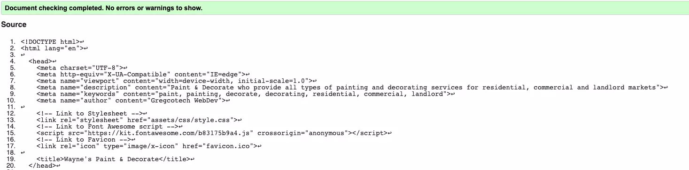

## CSS Validation

- [CSS Validator](http://www.css-validator.org/#validate_by_input):
    - The website was used validate CSS styling code for any errors. Unfortunately, the website presented server errors every time and I was unable to get a complete validation on this time around.

## Lighthouse Testing

#### Mobile

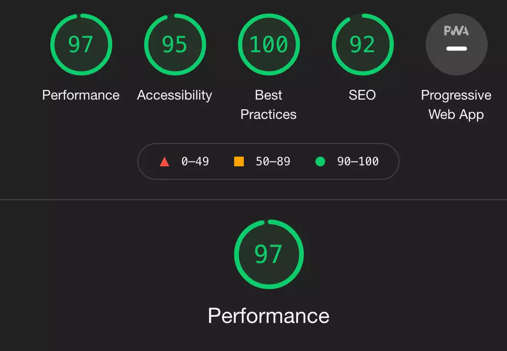

### Desktop

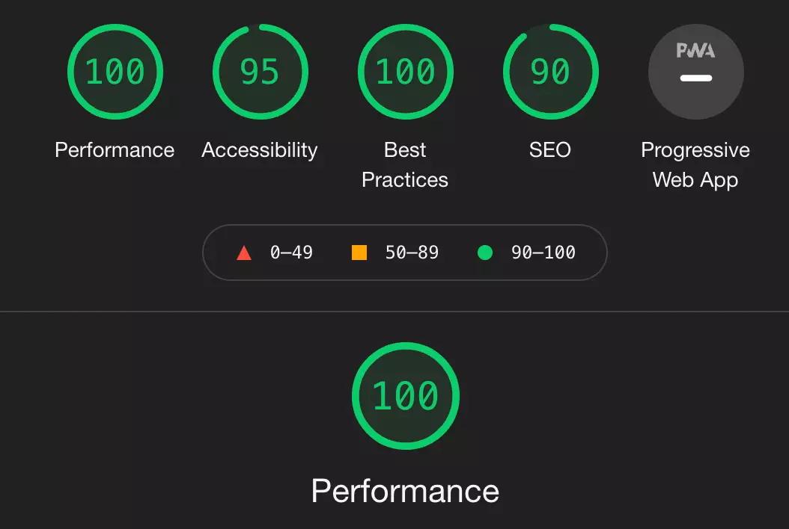

# Deployment
For deployment of the website to a live publicly accessible website, the following steps were required:

- Confirmed that correct repository is selected as 'paintanddecorate'
- Select 'Settings'
- Scroll down to 'GitHub Pages' and click on 'Check it out here!'
- On the 'Source' section, select Branch as 'main' and click on 'Save'.
- Your site is published at https://gregcotech007.github.io/paintanddecorate/

Commands used to add, commit and push changes to GitHub:
- git add . (Used to add all changes)
- git commit -m "Commit message" (Commit message to inform of the changes)
- git push (Used to push changes to GitHub).

# Cloning

To clone a copy of the code in the repository, the following steps are required:

- Go to https://github.com and select the Repository called 'paintanddecorate'
- Click on the button called 'Code" and a pop-out window will show options to Clone through:
    - HTTPS
    - SSH
    - GitHub CLI

1. On GitHub.com, navigate to the main page of the repository.
2. Above the list of files, click  Code.
3. To clone the repository using HTTPS, under "Clone with HTTPS", click 'Clipboard to copy'. To clone the repository using an SSH key, including a certificate issued by your organization's SSH certificate authority, click Use SSH, then click 'Clipboard to copy'. To clone a repository using GitHub CLI, click Use GitHub CLI, then click 'Clipboard to copy'.
4. Open Terminal.
5. Change the current working directory to the location where you want the cloned directory.
6. Type > git clone and then paste the URL you copied earlier. 
    > $ git clone https://github.com/YOUR-USERNAME/YOUR-REPOSITORY
7. Press Enter to create your local clone.
    > $ git clone https://github.com/YOUR-USERNAME/YOUR-REPOSITORY

    > Cloning into `Spoon-Knife`...

    > remote: Counting objects: 10, done.

    > remote: Compressing objects: 100% (8/8), done.

    > remove: Total 10 (delta 1), reused 10 (delta 1)

    > Unpacking objects: 100% (10/10), done.

8. Repository Clone is now complete.

# Credits

## Tools & Images

- [Google Fonts](https://fonts.google.com/):
    - Google Fonts was imported into the css file to allow use of the following fonts: Open Sans & Poppins.

- [Font Awesome](https://fontawesome.com/):
    - Font Awesome was used to add Font Icons to improve the visual experience for the users.

- [Balsamiq](https://balsamiq.com/):
    - Balsamiq was used to create Wireframe design plans for both mobile and desktop views.

- [Compress PNG](https://compresspng.com/):
    - Compress PNG was used to compress the overall size of the PNG image.

- [Cloud Convert](https://cloudconvert.com/):
    - After the PNG file was compressed, I then further converted the file from 'png' to 'webp', to help reduce
    the overall file size and help with performance and load time on the website.

- [Favicon Generator](https://favicon.io/favicon-generator/)
    - The website allowed me to create and generate a Favicon for the website with the characters 'P&D'.

- [Images: Pexels](https://www.pexels.com/)
    - All images used are 'free to use' images.

- [Images: Freepik](https://www.freepik.com)
    - All images used are 'free to use' images.

- [HTML: Code Beautify](https://codebeautify.org/htmlviewer)
    - Website allows to beautify code and layout for HTML.

- [CSS: Code Beautify](https://codebeautify.org/css-beautify-minify)
    - Website allows to beautify code and layout for CSS.    

## Tutorials & Resources

- [GitHub: Clone a Repo](https://docs.github.com/en/repositories/creating-and-managing-repositories/cloning-a-repository)
    - The link includes the full step-by-step instructions from GitHub Support on how to clone a repo.

- [FollowAndrew: Responsive Pure CSS Menu Tutorial (No Javascript)](https://favicon.io/favicon-generator/)
    - Hamburger Menu: I found the tutorial for creating the hamburger menu with pure CSS, very beneficial and well explained. It was very intuitive and highly recommend.

- [Dani Krossing: Add Favicon to a Website](https://www.youtube.com/watch?v=kEf1xSwX5D8)
    - The tutorial was easy to follow, well explained and simplied the process in adding a Favicon..

- [Traversy Media: Build An HTML5 Website With A Responsive Layout](https://www.youtube.com/watch?v=Wm6CUkswsNw)
    - I found this tutorial inspirational to the design and structure of my website. I like the colours on the website and I found that they complemented the website.

- [Code Institute](https://codeinstitute.net)
    - The LMS tutorials were beneficial in giving me an insight into starting my first website coding project.
    - Also, I found inspiration from the 'Love Running' project which helped with ideas.
    - Code Institute Mentor.

# Conclusion

I started out on this project journey a few weeks ago, not knowing what Gitpod or GitHub was. I had heard about HTML and CSS, but was not familiar with CSS or even the words div and float, to name a few.

I enjoyed learning the Code Institute LMS and completing the challenges. The course is well-structured and getting the experience on the Coders Coffeehouse and Love Running, were great projects to get started with and exposed to.

I have had a few issues along the way with my Gitpod Workspace. As a result, I had created more than 1 workspace/repo to work with and practice on. There were global issues on a couple occasions where I could not access my workspace, as it was down.

As you will notice from my commits, I had started a new repo on another GitHub profile that I created, as I couldnt get onto my existing one. I worked tirelessly over 12 hours last night to compile a brand new workspace and repo. This has had it advantages from a learning point of view, writing and rewriting code, it was allowing me to understand it better and remove any unessessary code. Also, I have spent another long night tonight to complete it and sign it off for submission. 

https://github.com/gregcodev/p1_paintanddecorate

The link above is the link for my secondary GitHub account, which will acount for the commits on the new account. I tried to log back in this evening on the new account and it advised that I had my time was used up. Luckily I had a copy of my code and I started to import it back into my existing repo and recording new commits to replace the previous code.

Overall, I have found the modules on HTML and CSS as challenging at times, I didn't lose faith with it and I kept working on it. I understand that there are many options to simplify CSS such as Flexbox and Grid CSS, but my intention was to learn and use raw CSS for the first project at least so I would get a better insight into how it works.

I would like to thank you for opportunity in reading my project and I look forward to the next challenges ahead...

Greg
